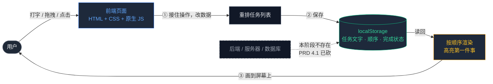

# TECH_DESIGN｜强制排序待办小工具 · 技术方案

> 项目：vibe-coding ｜ 阶段：第 1 周 · Day 5 ｜ 版本：v1.0
> 上游：`PRD.md`（Day 4 产品需求，10 条验收标准）｜ 下游：MVP 开发（Day 7）
> 修改规则：技术方案只对 PRD 第 3 节的 8 项 MVP 功能负责；PRD 改了范围，本文档跟着改。

---

## 1｜一句话说清：数据从哪来、到哪去

**任务数据由用户亲手产生（键盘输入、拖拽、点击），当场存进浏览器的 localStorage，页面每次打开都从那里读回来渲染。**

- **从哪来**：用户的操作 —— 输入文字、拖拽排序、点击完成/删除、编辑文字。
- **到哪去**：浏览器的 localStorage（页面关闭也不丢）。
- **中间谁在动**：页面里的 JS 代码，负责「接到操作 → 改数据 → 存回去 → 重画页面」。

这四步就是本产品全部的数据活动。**没有服务器、没有网络请求、没有数据库。**

---

## 2｜前后端与数据库怎么分工

用大白话区分三层：

| 层 | 管什么 | 大白话 | 本项目 Day 7 由谁承担 |
| --- | --- | --- | --- |
| **前端** | 看得见、点得到的东西 | 页面长什么样、点了有什么反应 | 网页本体（HTML + CSS + JS） |
| **后端** | 看不见的规矩和保管 | 谁有权限、多人怎么共享、存服务器上 | **暂无**（PRD 4.1 已砍，Day 23 之后再议） |
| **数据库** | 长期存得住的地方 | 换设备数据还在、多人看到同一份 | **暂无**，用浏览器 localStorage 顶替 |

### 2.1 为什么本项目「没有后端」不是偷懒

后端存在的意义是解决三类问题：**账号与权限、多人协作、跨设备数据**。对照 PRD 第 4.1 节的砍功能清单：

| 后端能解决的问题 | 本项目的决定 | 依据 |
| --- | --- | --- |
| 账号注册 / 登录 | 不做 | 单人工具，PRD 4.1 |
| 多人协作 / 共享清单 | 不做 | 单人使用是产品前提，PRD 4.1 |
| 跨设备云同步 | 不做 | MVP 阶段不接数据库，PRD 4.1；排进第 6 节后续迭代 |
| 服务器长期存储 | 不做 | localStorage 对单人本地使用绰绰有余，PRD 4.1 |

**结论：8 项 MVP 功能里，没有任何一项需要后端。** 强行加后端 = 引入账号系统、服务器、部署、费用，而用户只有一个人、只用一台设备 —— 付出的代价换不来任何 PRD 里承诺的能力。

### 2.2 那 localStorage 算「数据库」吗？

不算，但在这个项目里**够用**，理由是它满足 MVP 的唯一存储要求：**刷新 / 关浏览器再打开，数据不丢**（PRD 验收标准第 9 条）。

| 对比 | localStorage | 真正的数据库 |
| --- | --- | --- |
| 存在哪 | 用户自己的浏览器里 | 服务器上 |
| 换设备能看到吗 | 不能 | 能 |
| 多人能共享吗 | 不能 | 能 |
| 本项目够用吗 | **够**（验收第 9 条只要求本地不丢） | 超出需要 |

**它的边界很清楚**：换台电脑、换个浏览器、清空浏览器数据，任务就没了。这正是 PRD 第 6 节把「数据导入导出」和「账号 / 云同步」排进后续迭代的原因 —— 问题认了，但不在 MVP 解。

---

## 3｜技术路线

### 3.1 三条路线对比

| 维度 | 路线 A：纯前端单页 ✅ | 路线 B：前端框架 + 构建工具 | 路线 C：前端 + 后端 + 数据库 |
| --- | --- | --- | --- |
| **用什么** | HTML + CSS + 原生 JS + localStorage；拖拽用浏览器原生 Drag & Drop API | React/Vue + Vite + npm 依赖 | 路线 B + Node 后端 + 数据库 |
| **能覆盖 8 项功能吗** | 能，全部覆盖 | 能，全部覆盖 | 能，但多出来的能力 PRD 里没有 |
| **上手成本** | 低：会 HTML/CSS/JS 就能写 | 中：要先学框架语法、组件、状态管理、构建流程 | 高：还要学服务端、数据库、部署、鉴权 |
| **要装什么** | 什么都不用装，浏览器就能跑 | 装 Node + 一堆依赖 | 装全套开发与运行环境 |
| **Day 7 一个人几天做得完吗** | **做得完** | 紧张 | 做不完 |
| **有额外成本吗** | 零依赖、零费用、无需部署 | 构建步骤变多，调试链路变长 | 服务器费用、运维、安全 |
| **代价 / 缺点** | 换设备数据不跟着走 | 学习成本挤占做功能的时间 | 远超 MVP 范围，且 PRD 已砍数据库 |
| **和 PRD 的对齐度** | 完全对齐 | 部分超纲 | 违背 PRD 4.1 |

### 3.2 选择：路线 A（纯前端单页）

**选它的三个理由**，都从 PRD 长出来、不凭空说：

1. **够用 —— 8 项功能一项不缺。** 添加、拖拽、高亮第一件事、标记完成、删除、撤销、编辑、保存，全部是浏览器里就能完成的事。拖拽用浏览器原生的 Drag & Drop API，不需要任何库。
2. **便宜 —— 零依赖、零费用、零部署。** 用户双击 `index.html` 就能用，不需要装软件、不需要联网、不需要服务器。这是单人工具最合适的形态。
3. **划算 —— 学习成本最低，时间留给功能。** Day 7 要交付 10 条可验收的标准，把时间花在「把拖拽和撤销做对」上，比花在「配好构建工具」上更值。参考 PRD 第 5 节的实现顺序建议：先核心闭环，再体验补全。

**为什么暂时不选 B / C**：不是因为 B / C 不好，而是**它们解决的问题本项目现在没有**。等产品真的需要多设备同步（PRD 第 6 节唤醒条件之一「换设备或清浏览器数据时」），再升级到 C 也不迟 —— 届时前端这套代码大部分能保留。

> **降级说明（按今日清单的「卡住降级」条款）**：本方案已采用路线 A 作为单一推荐，未做多路线并行验证；上文 3.1 的对比表即为「为什么暂时选它」的书面理由。

### 3.3 技术栈清单（本项目实际会用到的）

| 技术 | 在本项目里干什么 | 属于哪一层 |
| --- | --- | --- |
| HTML | 搭页面骨架：输入框、任务列表、「第一件事」区域 | 前端 |
| CSS | 管外观：高亮第一名、完成划线、拖拽时的视觉反馈 | 前端 |
| JavaScript（原生） | 管行为：读写数据、重画列表、处理拖拽和点击 | 前端 |
| Drag & Drop API（浏览器内置） | 实现拖拽排序，位置即优先级 | 前端 |
| localStorage（浏览器内置） | 存任务和顺序，关掉浏览器也不丢 | 数据存储（顶替数据库的角色） |
| Git / GitHub | 版本管理、代码入库与推送 | 开发工具 |

**注意**：这张表里没有一个需要 `npm install`。整条路线只用浏览器自带能力。

---

## 4｜形态规划：网页 → 桌面小工具（Day 5 讨论结论）

> 背景：Day 5 用户提出希望把它做成**桌面小工具**。经讨论决定：**技术路线里预留，Day 7 仍只交网页形态**。

### 4.1 当前形态 vs 规划形态

| | 当前形态（Day 7 交付） | 规划形态（Day 7 之后） |
| --- | --- | --- |
| 怎么打开 | 浏览器打开 / 双击 `index.html` | 桌面双击图标，独立窗口，可常驻 |
| 技术本质 | 纯网页 | **同一个网页 + 一层桌面外壳** |
| 网页代码要重写吗 | — | **不用，绝大部分可直接复用** |
| 数据存哪 | localStorage | 先沿用 localStorage，后续可迁到本地文件 |

### 4.2 为什么不在 Day 7 就做桌面版

**一句话：Day 7 的 10 条验收标准全部是网页行为描述，在网页里验收最直接。**

1. **验收标准是为网页写的** —— PRD 第 5 节：回车添加、拖拽排序、刷新不丢，逐条都能在浏览器里当场点开验证。套进桌面壳里验同样的事，链路更长、更容易卡在打包环节。
2. **做不完的风险** —— 加桌面壳要先装工具链（Rust 或 Node 全家桶）、学打包配置，这些都会挤占做 8 项功能的时间。宁可先交一个能用的网页，也不交一个打包失败的桌面壳。
3. **顺序更聪明** —— 「给已经能跑的网页穿衣服」比「一边写功能一边调打包」简单得多。网页稳了，加壳是一层薄薄的包装。

### 4.3 加壳时会受影响的文件（预案，Day 7 后执行）

| 文件 / 环节 | 加壳后要不要动 | 怎么动 |
| --- | --- | --- |
| `index.html` / CSS / JS | 基本不动 | 逻辑照旧，可能微调窗口尺寸适配 |
| 存储读写代码 | **要动** | 从 localStorage 换成壳提供的本地存储或文件读写 |
| 新增加壳配置 | 新增 | 桌面壳的入口配置文件（如 Tauri 的 `tauri.conf.json`） |
| 打包 / 发布流程 | 新增 | 新增「构建桌面安装包」这一步，原网页流程保留 |
| `README.md` | 更新 | 补充桌面版的打开方式和构建命令 |

**结论**：加壳不是重做，是**外包一层**。今天的技术路线选择（纯前端）恰恰让这条路更好走 —— 网页越干净，包裹越容易。

---

## 5｜数据流图（见 `data-flow.svg`）

数据流图单独存放，见同目录 `data-flow.svg`，另在 5.1 节附等价的文字版（GitHub 上可直接阅读）。

### 5.0 图（Mermaid 版，GitHub 上可直接渲染）

### 5.1 两条主流向（文字版）

**流向一：添加一条任务**
1. 用户在输入框打字 → 按回车
2. JS 捕获回车事件，取出输入的文字
3. 生成一条任务对象（含文字、位置、完成状态）
4. 追加到列表**末尾**（位置 = 优先级，新任务排最后）
5. 把整个列表写进 localStorage
6. 重新渲染页面：「第一件事」区域刷新为当前第 1 位

**流向二：打开 / 刷新页面**
1. 用户打开页面
2. JS 从 localStorage 读取任务列表
3. 若为空 → 「第一件事」区域显示「先加一件事」引导文案
4. 若不为空 → 按保存的顺序渲染列表，高亮第 1 位未完成任务

**流向三：拖拽改优先级（核心特色）**
1. 用户按住某条任务拖到新位置 → 松手
2. JS 按新位置重排数组
3. 写回 localStorage
4. 重新渲染：第 1 位变了，「第一件事」高亮随之更新

### 5.2 一句话总结

**数据只有两个家 —— 用户的操作（产生）和 localStorage（保管）；页面是它的舞台，每次打开都重新搬上来演一遍。**

### 5.3 加桌面壳后这一环怎么变（预案）

本图按**网页形态（Day 7 实际交付）**绘制。若日后加桌面壳，只有「存进 localStorage」这一步会换成「存进桌面壳的本地存储」——**其余每一步都不变**。这也是把加壳排在 Day 7 之后的原因：数据流的主体结构不用返工。

---

## 6｜技术风险与对策

| 风险 | 会不会发生 | 对策 |
| --- | --- | --- |
| 拖拽 API 在移动端浏览器兼容性差 | 可能 | MVP 先保证桌面浏览器体验；手机能打开但不强求完美拖拽 |
| localStorage 有容量上限（约 5MB） | 不会 | 待办文字量级极小，远不到上限 |
| 用户清空浏览器数据导致任务丢失 | 会 | 已在 PRD 第 6 节排入「数据导入导出」，MVP 阶段明示该局限 |
| 加桌面壳时存储层要改 | 会（已规划） | 见第 4.3 节，改动集中在存储读写一处 |

---

## 7｜本方案对 PRD 的承诺

- 只做 PRD 第 3 节的 8 项功能，一条不多（对应验收标准第 10 条：页面上找不到范围外功能的入口）。
- 技术路线纯前端，**不引入任何 PRD 第 4.1 节砍掉的能力**（账号、协作、数据库、云同步）。
- 逐条对应的实现方式留待 Day 7 开发时在代码里落实。

---

*本文档为 Day 5 产出。Day 7 开发只对本方案与 PRD 第 3 节负责；方案若变更，须同步更新第 5 节数据流图与 PRD 第 5 节验收标准。*
